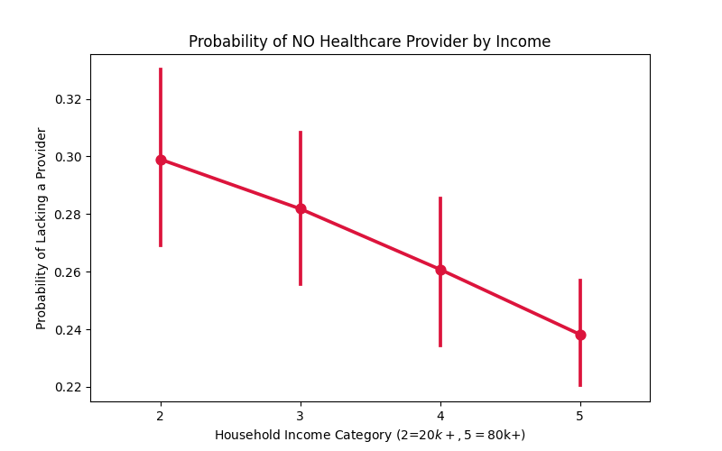
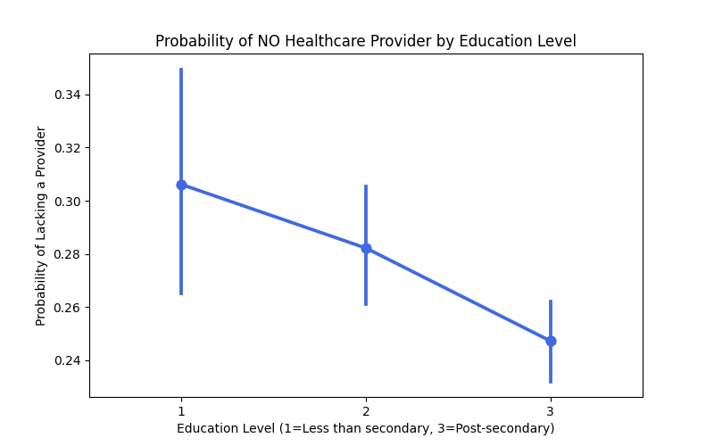
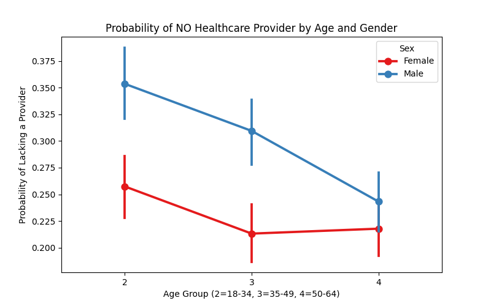
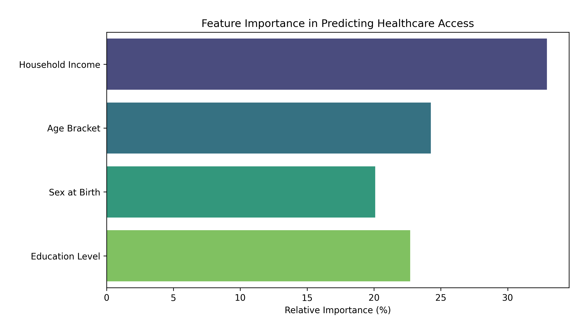

# Healthcare Access vs. Income Analysis

## Project Overview
This analysis explores the Canadian Community Health Survey (2022) to determine the relationship between **Household Income** and access to a **Regular Healthcare Provider**. The question at the heart of this project is: *Does making more money predictably increase a person's chances of having a primary care doctor?*

## Dataset and Preprocessing
The original dataset was extensively cleaned. We dropped duplicates, filtered out invalid responses (e.g., "Refusal" or "Don't know"), and focused only on respondents who provided valid data across all relevant demographic categories (income, perceived health, age, education, and working status).

### The Anomaly: Dropping Bracket 1
Initially, an anomaly was present in the lowest income bracket (Bracket 1, under \$20,000). The data showed that respondents in this bracket had surprisingly high access to doctors. This is a common statistical artifact caused by dependents (like students or young adults living with parents) who report zero personal income but still benefit from their family's high-quality healthcare coverage. 

By removing this "noise" (dropping Bracket 1) and focusing strictly on the independent adult brackets (Brackets 2 through 5), a clear and distinct trend emerges.

### Cleaned Summary Statistics (Income Brackets 2-5)
After cleaning and filtering, our dataset yielded **5,369 valid respondents**.

| Statistic | Perceived Health | Regular Healthcare Provider | Age | Sex at Birth | Province | Household Income | Education Level | Working Status |
| :--- | :--- | :--- | :--- | :--- | :--- | :--- | :--- | :--- |
| **Count** | 5369.0 | 5369.0 | 5369.0 | 5369.0 | 5369.0 | 5369.0 | 5369.0 | 5369.0 |
| **Mean** | 2.58 | 2.62 | 3.07 | 1.53 | 36.67 | 3.90 | 2.56 | 1.26 |
| **Std Dev** | 1.13 | 1.71 | 0.83 | 0.50 | 16.74 | 1.11 | 0.63 | 0.44 |
| **Min** | 1.0 | 1.0 | 2.0 | 1.0 | 10.0 | 2.0 | 1.0 | 1.0 |
| **25%** | 2.0 | 1.0 | 2.0 | 1.0 | 24.0 | 3.0 | 2.0 | 1.0 |
| **50%** | 3.0 | 2.0 | 3.0 | 2.0 | 35.0 | 4.0 | 3.0 | 1.0 |
| **75%** | 3.0 | 5.0 | 4.0 | 2.0 | 48.0 | 5.0 | 3.0 | 2.0 |
| **Max** | 5.0 | 5.0 | 4.0 | 2.0 | 60.0 | 5.0 | 3.0 | 2.0 |

**Understanding the Summary Statistics Codes:**
The numeric values in the table above represent **categorical integer codes**, not raw continuous numbers (e.g., an Age of 2 does not mean 2 years old). Here is a quick reference for interpreting these values:
*   **Age:** 1 = 12-17 years, 2 = 18-34, 3 = 35-49, 4 = 50-64, 5 = 65+. *(Notice the Age range is strictly 2 through 4: youths under 18 and seniors 65+ typically lack valid "Working Status" reports and were therefore cleanly filtered out of this workforce-focused dataset!)*
*   **Household Income:** 2 = \$20k-\$39.9k, 3 = \$40k-\$59.9k, 4 = \$60k-\$79.9k, 5 = \$80k+.
*   **Perceived Health:** 1 = Excellent, 2 = Very Good, 3 = Good, 4 = Fair, 5 = Poor.
*   **Education Level:** 1 = Less than secondary, 2 = High school grad, 3 = Post-secondary degree.
*   **Working Status:** 1 = Full-time, 2 = Part-time.

*Note: For the target modeling, "Regular Healthcare Provider" responses equal to 5 ("Don't have a regular health care provider") were separately encoded as `1` (No Provider), with all other valid providers encoded as `0`.*

## Understanding the Regression Results

When calculating the linear probability model on this data, two completely different $R^2$ values are observed. It is completely normal for these numbers to differ drastically, as they measure two fundamentally different insights.

### 1. Individual Variance ($R^2$ = 0.0013)
The standard $R^2$ evaluates the data at an **individual level**. It asks: 
> *"If I pick a random person from the street and I know their exact income bracket, can I perfectly guess whether they personally have a doctor?"*

Because individual human lives are incredibly complex, the answer is no. A person making \$80,000 might just refuse to seek medical care, while a person making \$30,000 might have a strict medical routine. The individual $R^2$ is incredibly low because income alone does not strictly dictate *individual* medical habits.

### 2. Population Macro-Trend ($R^2$ = 0.9964)
The Macro-Trend $R^2$ evaluates the data at a **population level**. It asks: 
> *"As an entire population gets wealthier, does the average frequency of doctor access predictably improve?"*

When we group the data by income to average out the individual "chaos" and view the macro-trend, a virtually undisputed pattern emerges:
*   **Bracket 2 (\$20k-\$40k):** 30.11% chance of NO doctor
*   **Bracket 3 (\$40k-\$60k):** 27.94% chance of NO doctor
*   **Bracket 4 (\$60k-\$80k):** 25.77% chance of NO doctor
*   **Bracket 5 (\$80k+):** 23.61% chance of NO doctor

There is a brutally consistent **~2.2% drop in risk per income bracket increase**. Because this downward staircase is almost perfectly linear as wealth increases, the Macro-Trend $R^2$ achieves an incredibly high **0.9964**.

## How Do Education Levels Relate?
A similar phenomenon occurs when we map access to primary care against an individual's **Education Level**. 

When looking at the same cleaned dataset (Independent adults, Brackets 2-5), we discover another clear downward staircase in the risk of being without a doctor:

*   **Education Level 1 (Less than secondary):** 30.6% chance of NO doctor (n=392)
*   **Education Level 2 (High school graduation):** 28.2% chance of NO doctor (n=1552)
*   **Education Level 3 (Post-secondary degree):** 24.7% chance of NO doctor (n=3425)

Just like Income, **Education Level acts as a protective factor**. Individuals who achieve a post-secondary degree decrease their risk of lacking a primary care doctor by nearly 6% compared to those who do not finish secondary school. 

Because income and education are heavily intertwined in the real world, these two metrics compound on each other to establish deep systemic disparities in Canadian healthcare access.

## How Do Age and Gender Impact Access?
Healthcare trends do not exist in a vacuum separated from biological demographics. Analyzing the same dataset grouped by Age Bracket and Sex at Birth reveals another dramatic discrepancy impacting provider access in Canada. 

Regardless of the age bracket, **females possess significantly wider access to primary care physicians than males.** 

*   **Age 18-34:** Males face a **35.3%** likelihood of being doctorless, while Females face **25.7%** (a 9.6% gap).
*   **Age 35-49:** Males face a **30.9%** likelihood of being doctorless, while Females face **21.3%** (a 9.6% gap).
*   **Age 50-64:** Males face a **24.3%** likelihood of being doctorless, while Females face **21.7%** (a 2.6% gap).

This data exposes a profound cultural and systemic healthcare habit. Young males significantly trail young females in maintaining a designated family doctor or general practitioner. Interestingly, while both genders establish better medical infrastructure as they inevitably age, the medical gender gap finally begins closing only when individuals cross the 50-year mark.

## Machine Learning Classification Model
In a Computer Science/Data Science context, attempting to predict a binary output (Has Doctor vs. No Doctor) is formally treated as a classification problem. We can train a **Random Forest Classifier** to assess how well individual traits—Household Income, Age, Sex, and Education Level—can collectively predict whether someone lacks a primary care provider.

Because the underlying behavioral choices of individual human beings contain massive amounts of variance/noise, demographic traits alone cannot perfectly predict any single individual's healthcare status. Our Random Forest model trained on this subset achieved an **Accuracy of ~58%** and a weighted F1-score of ~0.60.

However, the major value of the Random Forest model is that it calculates **Feature Importances**, confirming precisely which demographic parameters the algorithm relied on most heavily to make its predictions:

*   **Household Income:** 32.94% Importance
*   **Age Bracket:** 24.25% Importance
*   **Education Level:** 22.72% Importance
*   **Sex at Birth:** 20.09% Importance

This ML analysis clearly illustrates that while variables like Age and Education are extremely valuable to the algorithm, **Household Income (wealth) acts as the most dominant feature (nearly 33%)** when mathematically dividing and predicting healthcare accessibility across the Canadian population.

## Conclusion
The data tells a profound story about systemic healthcare inequality. While you cannot accurately predict a specific person's healthcare status based solely on their paycheck ($R^2$ = 0.0013), zooming out to a demographic level definitively proves that **wealth exerts a near-perfect linear pressure ($R^2$ = 0.9964) on a massive population's healthcare access.**

Beyond income, the analysis reveals that **education**, **age**, and **gender** all play critical roles in healthcare access. Higher education levels act as a protective factor, compounding with income to establish deep systemic disparities. Furthermore, females consistently maintain better access to primary care physicians than males across nearly all age groups, though this gap narrows significantly as individuals cross the 50-year mark.

Ultimately, as household income and education levels go up, and as populations age, the systemic risk of functioning without a primary care doctor predictably and consistently goes down.
